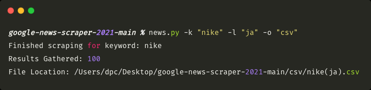

# Google News Scraper 2021 [Multilingual Supported]

[](https://github.com/topics/python) [](https://github.com/topics/web-scraping) [](https://github.com/topics/google)

## Description

Google News Scraper: get the latest news from [news.google.com](https://news.google.com) of any region and language to `csv` or `json` formats instantly.

## Requirements

- Python 3
- pip

## Installation

_Installing project files_:

```bash
git clone https://github.com/scrapewalrus/google-news-scraper-2021
```
_Installing project requirements_:


## Usage

To start using scraper simply launch terminal and locate to the root folder.

Example of scraping Nike news in Japanese:



For all the available `ISO 639-1` code representations of locations check the [Language Codes](https://github.com/scrapewalrus/google-news-scraper-2021/blob/main/iso-lang-codes.json) file.

## List of commands

Command | Expected Input
------------ | -------------
 `-k`| a keyword of your choice
 `-l` | `ISO 639-1` code representation of your preferred language
 `-o` | `csv` or `json`
 `--keyword` | a long form of `-k`
 `--location` | a long form of `-l`
 `--output` | a long form of `-o`

### Example json output
```json
[
    {
        "title": "A Hello Kitty x Nike Air Presto Retro Is in the Works - Complex",
        "link": "https://www.complex.com/sneakers/hello-kitty-nike-air-presto-retro-release-date",
        "publication_date": "2021-08-18"
    },
    {
        "title": "Take an Official Look at the NBA x Nike SB Nyjah Free 2 \"Lakers\" - HYPEBEAST",
        "link": "https://hypebeast.com/2021/8/nba-nike-sb-nyjah-free-2-lakers-official-look-release-info-da3439-100",
        "publication_date": "2021-08-19"
    },
    {
        "title": "Nike Dunk Low Bordeaux DD1503-108 Release Date | HYPEBEAST - HYPEBEAST",
        "link": "https://hypebeast.com/2021/8/nike-dunk-low-bordeaux-dd1503-108-release-date",
        "publication_date": "2021-08-18"
    }
```


### Example csv output


## Frequently Asked Questions

### How many results can I expect to get?
You can expect up to 100 results as this is the maximum you can get on https://news.google.com.
Results largely depend on a supplied keyword and location.

### Does this scraper support bulk queries?
Unfortunately, this scraper doesn't support bulk queries. If you want a more scalable approach for scraping news from Google, I suggest checking [Oxylabs Real-Time Crawler](https://oxylabs.io/products/real-time-crawler) or [Google News API by SERPmaster](https://serpmaster.com/products/google-news-api/) services.
